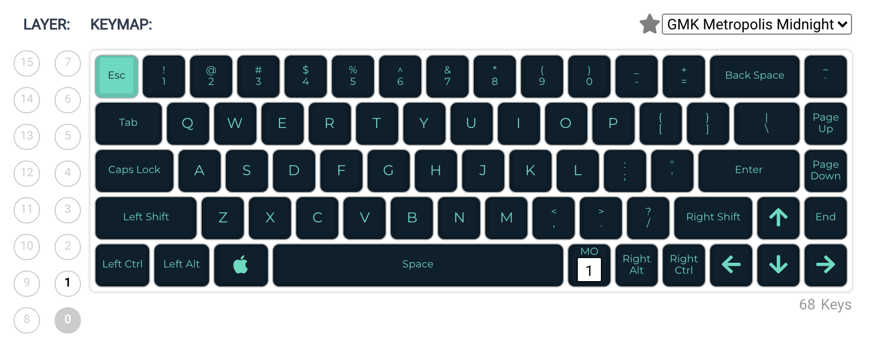
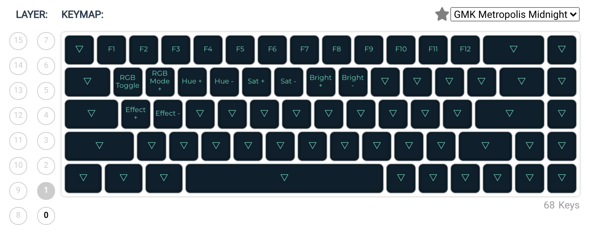

# keyboard-dz65rgb-v2-ansi

PCB name: `dztech/dz65rgb/v2`

Microcontroller: `atmega32u4`

DFU bootloader mode procedure: Hold `ESC` while connecting the USB cable.

---

QMK Firmware: https://qmk.fm/

Online QMK Configurator: https://config.qmk.fm/#/dztech/dz65rgb/v2/LAYOUT_65_ansi

QMK Toolbox: https://qmk.fm/toolbox/

---

**Layer 0 keymap**

**Layer 1 keymap**

